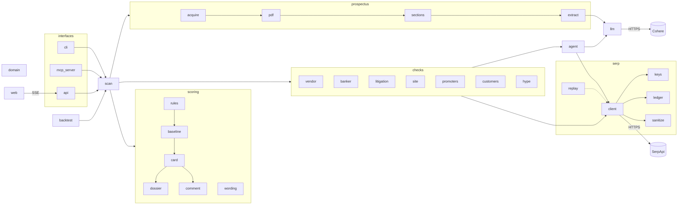
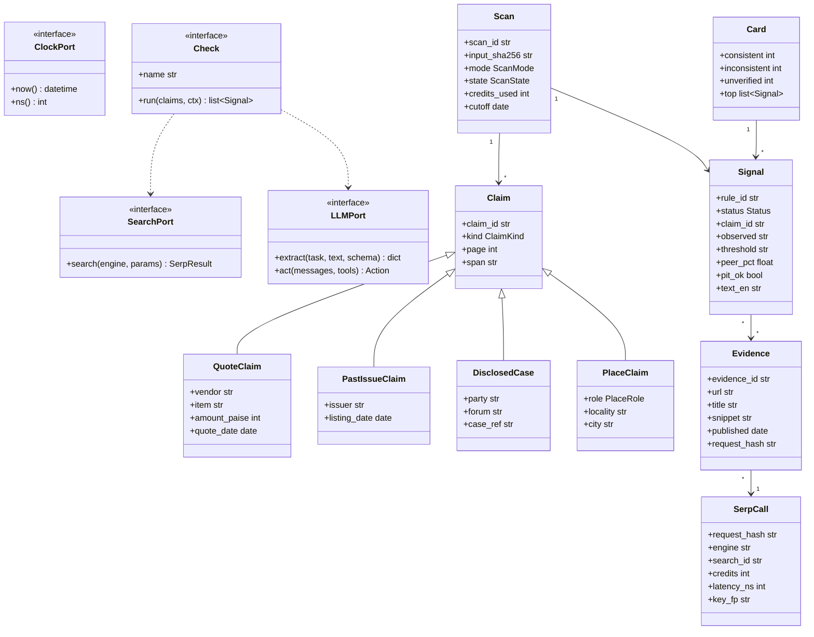
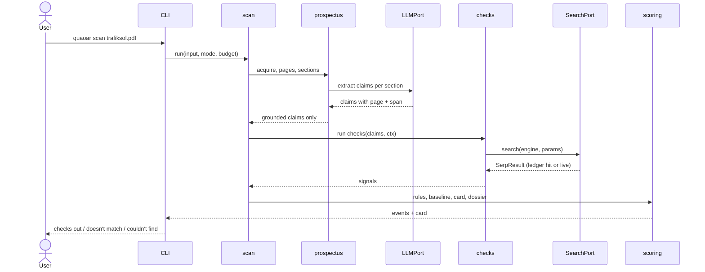
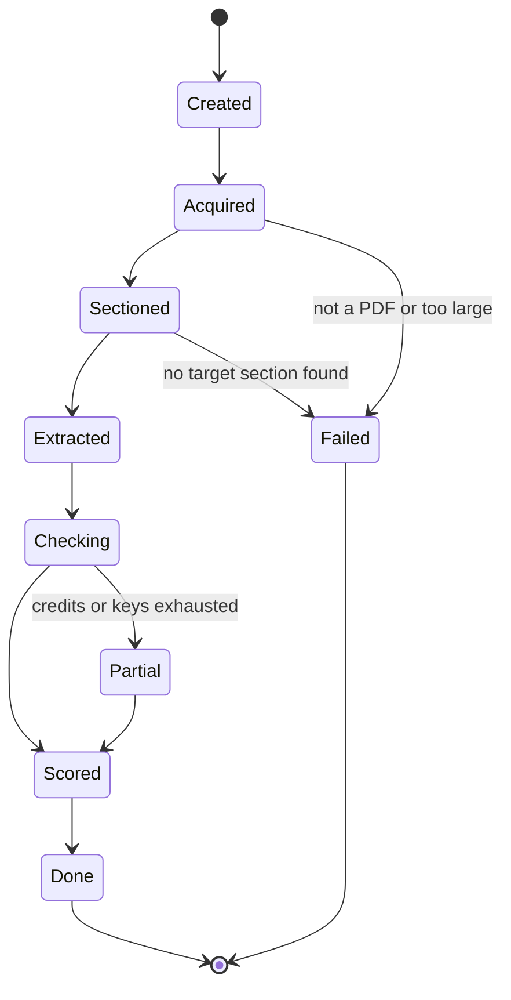
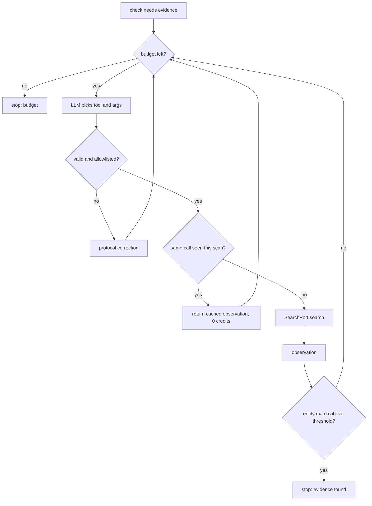
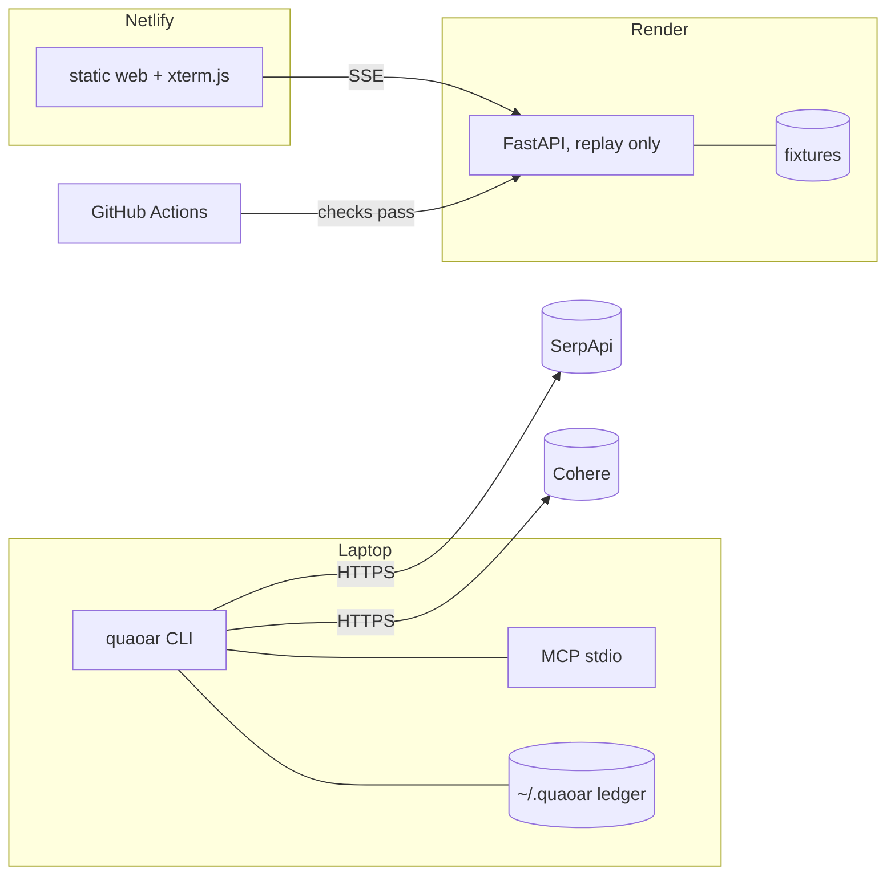

# grep -n '\[ORCHESTRA:NAME\]' PLAN_SPEC.md   <- jump straight to a section, never load the whole file
# QUAOAR: SME IPO prospectus reality check, built on SerpApi
# Single canonical spec for the SerpApi India Hackathon 2026 (deadline 2026-10-10 23:59 IST)

[ORCHESTRA:INDEX]
- [ORCHESTRA:STATUS]      : status labels, verified facts and their sources
- [ORCHESTRA:COMMON]      : mission, users, brand, scope, stack, layout, env
- [ORCHESTRA:RULES]       : hackathon rules and legal guardrails (hard constraints)
- [ORCHESTRA:STYLE]       : UML-first coding style, file order, comments, typing
- [ORCHESTRA:SDLC]        : phases, spec-driven + test-driven loop, definition of done
- [ORCHESTRA:GIT]         : worktrees, commit rules, integration, memory.md
- [ORCHESTRA:CICD]        : custom CI jobs, timing budgets, Render + Netlify deploy
- [ORCHESTRA:UML]         : component, class, sequence, state, activity, deployment diagrams
- [ORCHESTRA:DOMAIN]      : models, money, ids, names, dates
- [ORCHESTRA:PROSPECTUS]  : PDF intake, section locator, grounded claim extraction
- [ORCHESTRA:SERP]        : engine catalog, client, key pool, ledger, cache, replay, sanitizer
- [ORCHESTRA:CHECKS]      : vendor x-ray, banker track record, litigation diff, site visit, more
- [ORCHESTRA:AGENT]       : bounded ReAct loop over SerpApi tools, fixed-vs-agent ablation
- [ORCHESTRA:SCORING]     : signal rules, peer baseline, card, dossier, comment draft
- [ORCHESTRA:BACKTEST]    : labelled SEBI cases, point-in-time mode, metrics, audit
- [ORCHESTRA:INTERFACES]  : CLI, MCP server, SKILL.md, API, web console
- [ORCHESTRA:SECURITY]    : injection, secrets, privacy, download limits
- [ORCHESTRA:PERF]        : nanosecond/millisecond budgets and how CI measures them
- [ORCHESTRA:DELIVERABLES]: README, video script, submission checklist
- [ORCHESTRA:RISKS]       : what the probe must confirm, and the fallback for each
[/ORCHESTRA:INDEX]

---

[ORCHESTRA:STATUS]
## Status labels
- **Implemented**: verified in code and green in CI.
- **Partial**: a primitive exists but the user-facing behaviour is incomplete.
- **Missing**: no implementation yet.
- A number is only quoted as a result when a reproducible artifact in `results/` or `docs/benchmark-audits/` backs it. Targets are never written as results.

Current state (2026-10-09): spec written, nothing implemented. Every SPEC below is **Missing** until its tests pass in CI.

## Verified facts this design rests on (checked 2026-10-08/09)
- Deadline: "A complete submission must be received before October 10, 2026 at 23:59 IST" (official rules page). Some web-search summaries say October 5; that is wrong.
- Judging: idea strength, originality, technical complexity, usefulness, meaningful SerpApi usage; no fixed weights; overall 1st/2nd/3rd are ranked across all tracks before best-in-track.
- Trafiksol (SEBI order, Dec 2024, read in full): issue 345.65x subscribed, Rs 44.87 cr raised; Rs 17.70 cr of the objects was a software quote from a third-party vendor. A complaint by an investor association (SIREN) after issue close said the vendor had not filed financial statements with MCA. BSE's site visit found the vendor office locked; the vendor had been sold for Rs 20,000; two of three claimed clients denied any dealings; director profiles were fabricated; the auditor UDINs for three years were generated within five minutes on one evening. Listing was stopped and SEBI ordered a full refund.
- ICDR Schedule VI clause 7(b): when the objects include buying equipment or technology not yet ordered, the prospectus must disclose the quotation relied on. The vendor is therefore always named in the document.
- Synoptics (SEBI, May 2025): about 54% of IPO money diverted under the lead manager's direction; the banker (First Overseas Capital) was barred from new assignments and about 20 other SME issues it handled were put under examination.
- DroneAcharya (SEBI, Nov 2025): fictitious revenue booked against two clients whose registered addresses were ordinary homes and small shops; two-year market ban.
- Varyaa Creations: interim order May 2025 was **revoked** Dec 2025. Never use it as a positive label.
- Since the March 2025 ICDR amendments, SME draft prospectuses are open for public comments for 21 days, announced by a newspaper ad with a QR code.
- SEBI interim order (May 2026): social-media pump-and-dump across 82 mostly SME stocks, Rs 20.25 cr impounded.
- Competitor scan (238 hackathon repos, 2026-10-08): zero IPO or prospectus entries. Many generic scam/claim checkers. The name "Proof" collides with about ten projects; "Quaoar" collides with none.
- SerpApi's own showcase repo `serpapi/reviewaudit` sets the judges' taste: statistics against a baseline, "patterns worth a closer look, not findings", credits per run stated up front.

## Sources
- Rules: https://serpapi.github.io/serpapi-india-hackathon-2026/rules.html
- Trafiksol order: https://www.sebi.gov.in/sebi_data/attachdocs/dec-2024/1733225149153.pdf
- Synoptics: https://www.business-standard.com/markets/news/sebi-bars-sme-synoptics-merchant-banker-over-ipo-fund-diversion-125050601413_1.html
- Varyaa revocation: https://www.sebi.gov.in/enforcement/orders/dec-2025/revocation-order-in-the-matter-of-varyaa-creations-limited_98714.html
- DroneAcharya: https://www.businessworld.in/article/sebi-bans-droneacharya-aerial-innovations-promoters-for-two-years-over-fund-diversion-581718
- SME comment window: https://mmjc.in/sebis-new-sme-ipo-regulations-key-changes-and-implications/
- 82-stock order: https://www.outlookmoney.com/invest/sme-stock-fraud-sebi-bans-7-unregistered-finfluencers-over-rs-20-crore-social-media-scam
[/ORCHESTRA:STATUS]

---

[ORCHESTRA:COMMON]
## 1. Mission
Quaoar reads an SME IPO prospectus, pulls out the claims that can be checked against the outside world, and checks them through SerpApi before anyone applies. It reports what checked out, what did not match and what could not be found, each line with its source. It never calls anything fraud and never says buy or sell.

## 2. Users
- Retail investor: types a company name or drops a PDF, gets a plain card.
- Journalist / investor association: full dossier with sources, and a draft public comment for the 21-day window.
- Analyst / developer: CLI, MCP tools inside their own agent, backtest numbers.

## 3. Brand
- Name: **Quaoar**. Tagline: **"Check every IPO before you apply."** Hindi line: **"Pehle jaanch, phir apply."**
- Story: Quaoar's ring was found where theory said no ring could exist, and it was found without looking at it, by watching starlight dim. Quaoar finds what sits around an IPO the same way: from indirect public evidence.
- Theme stays on the dwarf planet. No deity imagery.
- Card language: "checks out" / "doesn't match" / "couldn't find", plus "Facts with sources. Not investment advice."

## 4. Scope
In: SME issues on BSE SME and NSE Emerge, their draft and final prospectuses, the checks in [ORCHESTRA:CHECKS], the backtest, CLI, MCP, SKILL.md, API, web console.
Out (non-goals): main-board IPOs, price prediction, ratings or recommendations, scraping NSE/BSE pages, OCR of scanned PDFs, user accounts, a graph database.

## 5. Why there is no graph database
The banker -> past issues -> SEBI orders and promoter -> other companies relationships are small (tens of rows per scan). They live as plain tables in the SQLite ledger and are shown as lists on the card. No Neo4j, no TigerGraph.

## 6. Stack
- Python 3.13, managed only through uv 0.9.5 (`uv sync --locked`, `uv run`, `uv build`, `uv tool install`).
- httpx (SerpApi + downloads), pydantic v2 (domain models), typer + rich (CLI), pypdfium2 (PDF text, permissive licence; PyMuPDF is avoided because it is AGPL), rapidfuzz (name similarity), cohere (LLM), fastapi + uvicorn (API), mcp (FastMCP server), sqlite3 and gzip from the standard library (ledger).
- Dev: pytest, pytest-cov, pytest-benchmark, hypothesis, mypy (strict, pydantic plugin), ruff, vulture, bandit, pip-audit.
- Web: TypeScript in strict mode compiled by `tsc` only (no framework), xterm.js, `node --test` for render functions.
- LLM: Cohere, one model locked per scan (`COHERE_MODEL`, default `command-a-03-2025`, confirm in the probe).

## 7. Repository layout
```text
quaoar/
├── PLAN_SPEC.md              # canonical spec (this file)
├── memory.md                 # compact live state, replaces BOARD.md
├── README.md                 # public pitch, quickstart, results, limits
├── LICENSE                   # MIT
├── pyproject.toml            # uv project + tool configs
├── uv.lock
├── .python-version           # 3.13
├── .env.example              # names only, never values
├── .gitignore
├── render.yaml               # Render blueprint for the API
├── netlify.toml              # Netlify build for web/
├── .github/workflows/ci.yml  # custom quaoar pipeline
├── scripts/gate.sh           # the exact checks CI runs, for local use
├── skills/quaoar/SKILL.md    # agent playbooks
├── data/cases.toml           # backtest labels with sources
├── fixtures/replay/<case>/   # sanitized serp + llm records, manifest with sha256
├── src/quaoar/
│   ├── __init__.py
│   ├── __main__.py
│   ├── config.py             # env, paths, budgets
│   ├── clock.py              # ClockPort, so tests control time
│   ├── events.py             # one event schema for CLI, API and web
│   ├── scan.py               # one scan end to end, emits events
│   ├── domain/               # models, money, ids, names, dates
│   ├── prospectus/           # acquire, pdf, sections, extract
│   ├── serp/                 # engines, client, keys, ledger, replay, sanitize, snippets
│   ├── llm/                  # cohere adapter, llm ledger, guard, prompts
│   ├── checks/               # base, vendor, banker, litigation, site, promoters, customers, hype
│   ├── agent/                # loop, tools, trace
│   ├── scoring/              # rules, baseline, card, dossier, comment, wording
│   ├── backtest/             # cases, runner, metrics
│   ├── cli.py
│   ├── mcp_server.py
│   └── api/app.py
├── web/                      # package.json, tsconfig.json, index.html, src/*.ts, test/*.test.ts
├── tests/
│   ├── unit/  contract/  golden/  e2e/  perf/  meta/
├── docs/
│   ├── decisions/            # ADR-0001-*.md
│   └── benchmark-audits/     # probe, backtest, perf audits
└── results/                  # gitignored except published audit outputs
```

## 8. Environment (`.env.example`)
```dotenv
# SerpApi: two or more keys from accounts you are entitled to use, comma separated
SERPAPI_API_KEYS=
# Cohere
COHERE_API_KEY=
COHERE_MODEL=command-a-03-2025
# shared ledger/cache for every worktree
QUAOAR_HOME=~/.quaoar
QUAOAR_MAX_CREDITS_PER_SCAN=45
QUAOAR_KEY_RESERVE=5
# public API runs replay only
QUAOAR_PUBLIC_MODE=replay
QUAOAR_CORS_ORIGIN=https://<site>.netlify.app
# CI absorbs runner noise in timing budgets
QUAOAR_PERF_SCALE=1
```
[/ORCHESTRA:COMMON]

---

[ORCHESTRA:RULES]
## Hackathon rules (hard constraints)
1. Submit before 2026-10-10 23:59 IST; edits allowed until then.
2. Demo is a screen recording under 3 minutes showing the project running locally with its core working.
3. Public GitHub repo with setup instructions; repo and video links open in an incognito window.
4. SerpApi must make a material contribution; isolated or cosmetic calls do not count.
5. Disqualification: exposed API keys, personal data or secrets in public materials; false claims; plagiarism or unauthorized reuse; abuse of SerpApi services.
6. One competitive award per project. Track: **Commerce & Market Intelligence**.

## Legal guardrails
- No investment advice (SEBI Investment Advisers Regs 2013, Research Analysts Regs 2014): no recommendations, ratings, price targets or "buy/avoid".
- Neutral wording: signals and patterns, never findings of wrongdoing.
- Facts with sources; quoted excerpts at most 300 characters.
- Search goes through SerpApi only. No scraping of NSE/BSE pages; prospectus PDFs come from a local path or a user-given URL, exchange hosts are refused with "download it manually".
- Personal data (DPDP Act): names only as printed in the filing; no individual's residential address is ever shown (locality level only); Maps reviewer identities and review text are dropped before storage.
- SerpApi keys: only from accounts you are entitled to use (yours, teammates', paid or hackathon credits). Creating accounts to dodge limits risks "abuse of SerpApi services".
- No Reddit sources.
- Code is written fresh for this repo. Stellium and Lunarbit lend patterns only, not code.
[/ORCHESTRA:RULES]

---

[ORCHESTRA:STYLE]
## UML first
- The diagrams in [ORCHESTRA:UML] are the contract. Each package under `src/quaoar/` is one component in the component diagram; classes match the class diagram; call order matches the sequence diagram. A meta test fails if a package exists that the diagram does not name, or the other way round (SPEC-STY-02).
- Ports and adapters: `SearchPort`, `LLMPort`, `ClockPort` are Protocols. Checks and the agent only see ports, so every test runs on fakes or replay records.

## Module by module
Build in dependency order, finishing each module (tests green, committed) before the next one uses it:
`domain -> serp -> prospectus -> llm -> checks -> agent -> scoring -> scan -> backtest -> cli/mcp/api -> web`.

## Top to bottom inside a file (stepdown order)
1. One `#` line saying what the module is for.
2. Imports (ruff sorted).
3. Constants.
4. Types and models.
5. Public functions, in the order a caller uses them.
6. Private helpers, each placed below its first caller.
Regions are separated by short banners: `# --- public ---`, `# --- helpers ---`.

## Block by block
Functions stay short (at most 60 lines, SPEC-STY-04). Inside a function, each step is a small block separated by a blank line and opened by a short `#` comment saying why, not what.

## Comments
- `#` only in Python, TOML and YAML; `//` in TypeScript; `<!-- -->` in HTML. No docstrings anywhere (SPEC-STY-01 fails CI on any).
- Short and human, like a colleague's note:
```python
# quote kept in paise so Rs 17.70 cr never drifts through floats
amount = parse_inr(span)

# registry snippets lag MCA by weeks, so staleness only counts past 18 months
if months_since(last_filed, cutoff) > 18:
```
- No commented-out code. No banner art. No restating the code.

## Typing and errors
- `mypy --strict` on `src/` and `tests/`. Domain models are frozen pydantic models.
- Money is integer paise, never float. Durations come from `time.perf_counter_ns()`, timestamps from `ClockPort`.
- Typed exceptions per module; no bare `except`; partial results are explicit states, never silent.
- No `print` in library code; the CLI renders with rich.
- Output is deterministic: sorted collections, ids from canonical JSON hashes.
[/ORCHESTRA:STYLE]

---

[ORCHESTRA:SDLC]
## Spec-driven + test-driven loop (every task)
1. **Spec**: the behaviour exists as a `SPEC-<AREA>-<NN> [P0|P1|P2]` line in this file, written Given / When / Then where useful.
2. **Red**: write the failing test first; its first line is `# spec: SPEC-<AREA>-<NN>`.
3. **Green**: smallest code that passes.
4. **Refactor**: keep the stepdown order and the short-block style.
5. **Gate**: `scripts/gate.sh` (same checks as CI).
6. **Commit**: one micro-commit holding test and code together (a red test is never committed alone, main stays green).
7. **Trace**: SPEC-STY-03 fails CI if a P0 spec has no test or a test cites an unknown spec.

## Test kinds
- `unit/`: pure functions, fakes for ports.
- `contract/`: real recorded SerpApi and Cohere JSON shapes parse into our models.
- `golden/`: replay a fixture bundle, compare card and dossier JSON byte for byte.
- `e2e/`: CLI and API over replay bundles.
- `perf/`: timing budgets with pytest-benchmark (marker `perf`).
- `meta/`: no docstrings, UML map, spec trace, wording guard, function length.
- hypothesis property tests for money, dates, names and hashing.
- Coverage gate: 85% of `src/quaoar` lines.

## Phases (SDLC) and definition of done
| Phase | Work | Done when |
|---|---|---|
| P0 Probe | about 50 real searches on Trafiksol, Synoptics, DroneAcharya and 2 controls | `docs/benchmark-audits/probe-2026-10-09.md` says keep or drop for each check |
| P1 Foundation | pyproject, CI, domain, money, ledger, key pool, sanitizer, replay | CI green, ledger round-trips a recorded search |
| P2 Prospectus | acquire, pages, sections, grounded extraction | Trafiksol sections located, claims grounded |
| P3 Checks | VX, BK, LT, SV (P0) | each check emits signals on replay bundles |
| P4 Agent + scoring | ReAct loop, rules, baseline, card, dossier | card renders, fixed and agent modes both run |
| P5 Backtest | cases, PIT mode, metrics, audit | audit doc with numbers and CIs committed |
| P6 Interfaces | CLI polish, MCP, SKILL.md, API, web, deploy | Netlify page streams Trafiksol replay from Render |
| P7 Release | security pass, perf budgets, README, video, tag v0.1.0 | submitted before 2026-10-10 21:00 IST (3 h buffer) |

Decisions that change the design get an ADR in `docs/decisions/` and a line in memory.md.
[/ORCHESTRA:SDLC]

---

[ORCHESTRA:GIT]
## Remote
`origin = https://github.com/simon-derock/quaoar.git`, trunk `main`. One agent (Claude Code) does all work.

## Worktrees
- Each task gets its own worktree and branch: `git worktree add ../wt-quaoar-<slug> -b feat/<slug>` (also `fix/`, `test/`, `docs/`, `ci/`).
- Long jobs (backtest, probe) run in their own worktree so main work is not blocked.
- All worktrees share one ledger through `QUAOAR_HOME`, so no search is paid for twice.
- Integration: rebase on `main`, run `scripts/gate.sh`, `git merge --ff-only`, push, remove the worktree. History stays linear and keeps the micro-commits.

## Commit rules (binding)
- Conventional subject: `<type>(<scope>): <summary>`, imperative, at most 72 characters. Types: feat, fix, test, refactor, perf, docs, build, ci, chore. Scope is the module (`serp`, `money`, `vendor`, ...).
- Body: at most three lines, what changed and why.
- **No trailers of any kind: no Co-Authored-By (never Claude), no Signed-off-by, no agent ids or signatures.**
- One logical change per commit; each commit passes the gate.
- Stage explicit paths only; never `git add -A` or `git add .`.
- Never commit `.env`, prospectus PDFs, unsanitized responses, `~/.quaoar`, or `results/` raw runs.
- Tag `v0.1.0` at submission.

## memory.md (replaces BOARD.md)
- At most 40 lines, committed, no secrets or personal data.
- Fields: `updated`, `phase`, `decisions`, `blocked`, `next`, `numbers` (measured only, with artifact path).
- Updated at the end of each phase or when a decision changes.
- Authority order: code/tests > git history > PLAN_SPEC.md > memory.md > chat.
[/ORCHESTRA:GIT]

---

[ORCHESTRA:CICD]
## CI: `.github/workflows/ci.yml` (custom for quaoar)
Triggers: push to `main` and `feat/**` `fix/**` `test/**` `docs/**` `ci/**`; pull requests to `main`; manual. Concurrency cancels superseded runs. Permissions: `contents: read`.

| Job | Purpose | Steps |
|---|---|---|
| `gates` | correctness and style | setup-uv (0.9.5, cache) -> `uv sync --locked` -> `ruff format --check` -> `ruff check` -> `mypy --strict src tests` -> `pytest -m "not perf" --cov=quaoar --cov-fail-under=85` (includes meta tests) -> `vulture src --min-confidence 80` -> `bandit -q -r src` -> `pip-audit` |
| `replay` | the product works with no keys | `quaoar scan --replay fixtures/replay/<case>` for every bundle, diff card JSON against `tests/golden/`, then `quaoar backtest --replay` and upload `results/ci/` |
| `perf` | timing budgets | `pytest -m perf --benchmark-json perf.json` with `QUAOAR_PERF_SCALE=3`, upload `perf.json`, write a ns/ms table to the job summary |
| `privacy` | nothing secret or personal ships | fixture audit script (keys, reviewer fields, addresses) + gitleaks on the full history |
| `web` | the console builds | setup-node 20 -> `npm ci` -> `tsc --noEmit` -> `tsc` -> `node --test` |

`gates` must pass before `replay` and `perf` start. Every job has a timeout (10 min) so a hang fails fast.

## CD
- **Render** (API): `render.yaml` blueprint, Python runtime, build `pip install uv==0.9.5 && uv sync --locked --no-dev`, start `uv run quaoar serve --host 0.0.0.0 --port $PORT`, `autoDeployTrigger: checksPass` so only green commits deploy, env `QUAOAR_PUBLIC_MODE=replay`, no SerpApi or Cohere keys on the server.
- **Netlify** (web): `netlify.toml` with `base = "web"`, `command = "npm ci && npx tsc"`, `publish = "dist"`, API base URL injected at build time.
- Release: tag `v0.1.0`; install path for users is `uv tool install git+https://github.com/simon-derock/quaoar`.
[/ORCHESTRA:CICD]

---

[ORCHESTRA:UML]
## Component diagram

Packages under `src/quaoar/` (SPEC-STY-02 checks this list): `domain`, `prospectus`, `serp`, `llm`, `checks`, `agent`, `scoring`, `backtest`, `api`.

## Class diagram (core)


## Sequence: one scan


## State: scan lifecycle


## Activity: agent step


## Deployment

[/ORCHESTRA:UML]

---

[ORCHESTRA:DOMAIN]
- SPEC-DOM-01 [P0] Ids are the first 16 hex chars of sha256 over canonical JSON (sorted keys, no spaces); the same content always gives the same id.
- SPEC-DOM-02 [P0] Company names normalize (case, punctuation, `pvt/private`, `ltd/limited`, `&/and`, `m/s`) before rapidfuzz `token_set_ratio`; similarity is reported in 0..1.
- SPEC-DOM-03 [P0] Dates parse from `12th March, 2024`, `12.03.2024`, `March 12, 2024`, `2024-03-12`; relative dates (`3 days ago`) resolve against the search's own `created_at`, never the wall clock.
- SPEC-MNY-01 [P0] `parse_inr` turns `Rs. 17.70 crore`, `₹1,77,00,000`, `INR 17.7 cr`, `177.00 lakhs` into integer paise; table unit headers (`₹ in lakhs`) are passed as context.
- SPEC-MNY-02 [P0] Money is never a float; `format_inr` prints Indian grouping and `Cr`/`L` short forms.
- SPEC-MNY-03 [P0] Property test: `parse_inr(format_inr(x)) == x` across 0..10^14 paise.
- Status enum: `CONSISTENT` (checks out), `INCONSISTENT` (doesn't match), `UNVERIFIED` (couldn't find), `NOT_APPLICABLE`.
[/ORCHESTRA:DOMAIN]

---

[ORCHESTRA:PROSPECTUS]
- SPEC-PDF-01 [P0] Input is a local path or an https URL. Downloads: https only, at most 40 MB, must start with `%PDF`, 30 s timeout. Hosts of NSE and BSE are refused with "download it manually" (their terms forbid automated collection).
- SPEC-PDF-02 [P0] Text per page via pypdfium2 with 1-based page numbers; a page with under 30 characters is marked `needs_ocr` and skipped (no OCR in v1).
- SPEC-PDF-03 [P0] The input sha256 is recorded; the same PDF always maps to the same scan input id.
- SPEC-SEC-01 [P0] The section locator finds page ranges for: Objects of the Issue/Offer, Our Business, Our Promoters and Promoter Group, Our Group Companies, Outstanding Litigation and Material Developments, General Information (lead manager), Other Regulatory and Statutory Disclosures (past issues table). It uses the table of contents first, then heading regexes.
- SPEC-SEC-02 [P0] A section counts only if its heading text is found on its start page; otherwise it is reported missing, never guessed.
- SPEC-CLM-01 [P0] Cohere extracts typed claims per section: QuoteClaim, LeadManagerClaim, PastIssueClaim, DisclosedCase, PlaceClaim, PromoterClaim, GroupCompanyClaim, CustomerClaim.
- SPEC-CLM-02 [P0] Every claim carries a page and a verbatim span. The span must be found in that page's text after whitespace and case normalization, or the claim is dropped and counted as `ungrounded`.
- SPEC-CLM-03 [P0] Amounts are recomputed by `parse_inr` from the span; numbers produced by the LLM are never used.
- SPEC-CLM-04 [P0] Extraction calls are recorded in the LLM ledger keyed by (model, prompt hash, section text hash), so replay needs no Cohere key.
- SPEC-CLM-05 [P1] If LLM output fails validation twice, a regex fallback parses the quotation and past-issue tables.
[/ORCHESTRA:PROSPECTUS]

---

[ORCHESTRA:SERP]
## Engine catalog (why each one is used)
| Engine | Used for | Checks |
|---|---|---|
| `google` | registry snippets (instafinancials.com, zaubacorp.com, tofler.in), SEBI orders (sebi.gov.in), court records (indiankanoon.org), insolvency (ibbi.gov.in, nclt.gov.in) | VX, BK, LT, PR |
| `google_news` | dated coverage of issuer, promoters, banker, grey-market chatter | VX, BK, LT, HY |
| `google_maps` | does the factory, office, vendor or customer exist, category, closed flag | VX, SV, CU |
| `google_maps_reviews` | oldest visible review as a lower bound on how long a place has been on Maps | SV |
| `youtube` | volume of IPO promotion videos before the issue opens | HY |
| `google_trends` | search-interest spike around the issue | HY |
| `google_finance` | past issues' current prices, only if the probe shows SME coverage | BK |
| `google_patents` | claimed patents exist (P2) | PT |
| `google_lens` | vendor team or factory photos reused from elsewhere (P2) | LN |
Account API (free) gives searches left per key. Searches Archive API links every evidence row back to SerpApi's stored copy. Never combine `site:` with `tbs` date filters (open issue #4396); filter dates locally.

## Client
- SPEC-SRP-01 [P0] One entry point `search(engine, params) -> SerpResult`. Engines and params are allowlisted per engine; `q` at most 512 chars; Google engines default to `gl=in`, `hl=en`.
- SPEC-SRP-02 [P0] Request hash = sha256 of canonical JSON of engine + params without `api_key`.
- SPEC-SRP-03 [P0] Errors are classified: QUOTA (rotate key), TRANSIENT (two retries with backoff on the same key), INVALID (fail), EMPTY (valid result with no items, negative-cached).
- SPEC-SRP-04 [P0] Every call is recorded with latency in ns, credits (0 for ledger or SerpApi cache hits), key fingerprint and `search_id`.

## Key pool
- SPEC-KEY-01 [P0] `SERPAPI_API_KEYS` is a comma list (falls back to `SERPAPI_API_KEY`). A key appears anywhere only as its fingerprint, the first 8 hex chars of its sha256.
- SPEC-KEY-02 [P0] At start the Account API is read for each key; the key with most searches left is used; keys at or below `QUAOAR_KEY_RESERVE` are skipped.
- SPEC-KEY-03 [P0] A QUOTA error marks the key exhausted for the run and moves to the next; when all are exhausted the scan ends `Partial` and unchecked claims become UNVERIFIED.
- SPEC-KEY-04 [P0] `QUAOAR_MAX_CREDITS_PER_SCAN` is enforced before each live call.

## Ledger and cache
- SPEC-LGR-01 [P0] SQLite at `$QUAOAR_HOME/ledger.sqlite3` in WAL mode, shared by all worktrees; tables `searches`, `llm_calls`, `scans`, `claims`, `signals`.
- SPEC-LGR-02 [P0] Response bodies are gzip JSON files named by their sha256; `quaoar ledger verify` recomputes every hash.
- SPEC-LGR-03 [P0] TTL per engine: news 6 h, google 7 d, maps 14 d, registry and legal 14 d, finance 1 d. Errors are never cached; empty results are cached 24 h and marked empty.
- SPEC-LGR-04 [P0] `quaoar ledger stats` shows credits by scan, engine and key, cache hit rate, p50/p95 latency.
- SPEC-LGR-05 [P1] `quaoar ledger export --scan <id>` writes a sanitized fixture bundle plus a manifest of sha256s.

## Replay
- SPEC-RPL-01 [P0] Replay reads only from a fixture bundle; any miss raises `ReplayMiss`. No network, no keys.
- SPEC-RPL-02 [P0] Replaying the same bundle twice gives byte-identical card JSON.

## Sanitizer
- SPEC-SAN-01 [P0] `api_key` is removed from params and from every URL in a stored response.
- SPEC-SAN-02 [P0] Maps reviews keep only date and rating; reviewer names, profile links, avatars, review text and images are dropped.
- SPEC-SAN-03 [P0] The CI privacy job fails on any key pattern, reviewer field or house-level address in `fixtures/`.
[/ORCHESTRA:SERP]

---

[ORCHESTRA:CHECKS]
All checks implement `Check.run(claims, ctx) -> list[Signal]`. Absence of evidence alone is never INCONSISTENT; it is UNVERIFIED. Only evidence dated on or before the cutoff (the prospectus date) counts in point-in-time mode.

## VX: vendor x-ray (the Trafiksol test)
- SPEC-VX-01 [P0] Quotation claims (vendor, item, amount, quote date) come from Objects of the Issue.
- SPEC-VX-02 [P0] Registry lookup: one `google` query on the company-data sites; snippet parser reads CIN, status, incorporation date, authorised and paid-up capital, last balance-sheet date, last AGM date, and records which site and snippet gave each value.
- SPEC-VX-03 [P0] `quote_to_capital = quote / paid_up_capital`. INCONSISTENT when at least 100x and at or above the peer 90th percentile; CONSISTENT otherwise; capital unknown gives UNVERIFIED.
- SPEC-VX-04 [P0] Filing staleness: INCONSISTENT when the last balance sheet is more than 18 months older than the cutoff, or the status is struck off, under strike-off or dormant.
- SPEC-VX-05 [P0] Presence: `google_maps` for `<vendor> <city>`; a match with similarity at least 0.85 is CONSISTENT, a matched place marked permanently closed is INCONSISTENT, no match is UNVERIFIED.
- SPEC-VX-06 [P1] Vendor legal and news footprint (SEBI, Indian Kanoon, news) before the cutoff.
- SPEC-VX-07 [P2] Website first-seen date via the Wayback CDX API, labelled as a non-SerpApi source.

## BK: merchant banker track record
- SPEC-BK-01 [P0] Lead manager name(s) from General Information or the cover page.
- SPEC-BK-02 [P0] Past-issues table rows (issuer, listing date, issue price, printed +30/+90/+180 day moves).
- SPEC-BK-03 [P0] For the 10 most recent past issuers, one query each on sebi.gov.in; a hit is an order page naming the issuer (similarity at least 0.9) dated before the cutoff. Results are shared across scans of the same banker through the ledger.
- SPEC-BK-04 [P0] One query for orders against the banker itself.
- SPEC-BK-05 [P0] `contagion = hits / past issues` with a Wilson 95% interval. INCONSISTENT when the banker has an order dated before the cutoff, or the interval's lower bound is at or above the peer 90th percentile; table missing gives UNVERIFIED.
- SPEC-BK-06 [P1] Printed price moves compared with `google_finance`, only if the probe confirms SME coverage.

## LT: litigation the prospectus didn't mention
- SPEC-LT-01 [P0] Disclosed cases for the issuer, promoters, directors and group companies (party, forum, case reference, amount, status).
- SPEC-LT-02 [P0] One combined query per name for the issuer and up to 4 promoters: `"<name>" (site:sebi.gov.in OR site:indiankanoon.org OR site:ibbi.gov.in)`, plus one `google_news` query for the issuer.
- SPEC-LT-03 [P0] Found matters are matched to disclosed ones by case reference, then forum + party. An unmatched matter dated on or before the cutoff with entity similarity at least 0.9 is INCONSISTENT ("possible matter not in the prospectus, worth checking"); a weaker match is UNVERIFIED.
- SPEC-LT-04 [P0] People are searched only by the name printed in the filing, never by address or phone.

## SV: digital site visit
- SPEC-SV-01 [P0] Registered office and manufacturing or warehouse places (locality, city) from Our Business / General Information.
- SPEC-SV-02 [P0] `google_maps` per place (at most 3): match is CONSISTENT, permanently closed is INCONSISTENT, no match is UNVERIFIED.
- SPEC-SV-03 [P0] Oldest review within at most 2 review pages gives "on Maps since at least YYYY-MM". Informational only, never INCONSISTENT on its own.
- SPEC-SV-04 [P1] A manufacturing claim at a place whose Maps category is residential, apartment or co-working is INCONSISTENT.

## P1 checks
- SPEC-PR-01 [P1] Promoter and group-company registry sweep: a group company described as active but struck off in the registry before the cutoff is INCONSISTENT.
- SPEC-CU-01 [P1] Named customers (the DroneAcharya pattern): a large contract with a customer whose only footprint is a residence or small shop is INCONSISTENT; anonymised customers are NOT_APPLICABLE.
- SPEC-HY-01 [P1] Hype vs substance: YouTube promotion videos in the 30 days before issue open, grey-market news mentions and the Trends spike, shown against the share of claims that checked out. Informational only.
- SPEC-CM-01 [P1] Public comment draft for the 21-day window, built from INCONSISTENT signals only, template first, with page references and source links. The user sends it; Quaoar never submits anything.
- SPEC-RD-01 [P2] Radar: recent SME draft prospectus filings found via `google` and `google_news`, queued for scanning.
- P2 extras: patents (PT), Lens photo reuse (LN), Ads Transparency (AD), Play Store (PS), Jobs headcount (JB), auditor orders (AU).
[/ORCHESTRA:CHECKS]

---

[ORCHESTRA:AGENT]
- SPEC-AG-01 [P0] Two modes behind the same Check interface: `fixed` (deterministic query templates) and `agent` (Cohere tool-use ReAct).
- SPEC-AG-02 [P0] Agent tools: `web_search`, `news_search`, `maps_search`, `maps_reviews`, `registry_lookup`, `legal_search`, `finish`. Arguments are validated; engines are allowlisted.
- SPEC-AG-03 [P0] Budget: at most 6 steps and a per-check credit cap. An identical repeated call returns the cached observation at 0 credits. A malformed action gets a protocol correction and is counted.
- SPEC-AG-04 [P0] The agent only proposes queries and entity matches. Statuses always come from the deterministic rules; the LLM never sets a status.
- SPEC-AG-05 [P0] Trace per check: steps, tool, args, credits, latency in ns, tokens, strategy changes with reason, stop reason.
- SPEC-AG-06 [P0] One Cohere model locked per scan; retries stay on the same model.
- Ablation: the backtest runs both modes and reports credits, recall and latency side by side. The agent earns its place only if it finds evidence the templates miss at an acceptable credit cost.
[/ORCHESTRA:AGENT]

---

[ORCHESTRA:SCORING]
- SPEC-SC-01 [P0] Signal fields: check, rule_id, status, claim_id (page), evidence ids, observed value, threshold, peer percentile, `pit_ok`, plain English text.
- SPEC-SC-02 [P0] Rules are pure functions under `RULESET_VERSION`; the ruleset hash is recorded and frozen before any labelled backtest run (pre-registration: no tuning to cases).
- SPEC-SC-03 [P0] Peer baseline: per numeric observable, percentiles from the control cases; with fewer than 8 peers the percentile is `None` and the absolute rule applies alone, and the card says so.
- SPEC-SC-04 [P0] Card: "N of M checks out · K don't match · U couldn't find", the top 3 that don't match with a one-line reason and a "show proof" link, and the disclaimer. No overall risk score.
- SPEC-SC-05 [P0] Wording guard: user-facing text never contains fraud, scam, fake, cheat, buy, sell, avoid, guaranteed or similar; a test covers templates and a runtime filter covers any LLM text.
- SPEC-SC-06 [P0] Dossier (Markdown + JSON): claim -> evidence (url, title, snippet of at most 300 chars, date, engine, `search_id`, archive url, sha256, fetched_at).
- SPEC-SC-07 [P1] Hindi card from fixed templates, no LLM translation.
[/ORCHESTRA:SCORING]

---

[ORCHESTRA:BACKTEST]
- SPEC-BT-01 [P0] `data/cases.toml`: company, exchange, cutoff date, prospectus source URL and sha256 (the PDF itself stays local and gitignored), label in {POSITIVE, PROBE, REVOKED, CONTROL}, label source URL and date.
- SPEC-BT-02 [P0] Controls are picked by a rule written down before any scan: same exchange, listed within 6 months of a positive, issue size within 0.5x to 2x, no SEBI order found on sebi.gov.in at selection time, prospectus available; the nearest two by listing date. Selection queries are kept in the ledger.
- SPEC-BT-03 [P0] Point-in-time mode drops evidence dated after the cutoff and marks undated evidence; results are reported both strict (dated evidence only) and "now".
- SPEC-BT-04 [P0] Metrics: an issuer is flagged when any VX, BK or LT signal is INCONSISTENT. Precision, recall and F1 with Wilson 95% intervals, per-check hit rates, lead time in days (label date minus cutoff) for flagged positives, credits per issuer, p50/p95 latency, fixed vs agent.
- SPEC-BT-05 [P0] Labels never reach the LLM; a test asserts no label string or label URL appears in any recorded prompt.
- SPEC-BT-06 [P0] Output goes to `results/backtest-<date>.jsonl` and `docs/benchmark-audits/backtest-<date>.md` (method, ruleset hash, fixture hashes, numbers, limitations).
- SPEC-BT-07 [P0] Checkpoint per case; `--resume` continues after a crash.

Initial labels (verify each before use):
- POSITIVE: Trafiksol ITS Technologies (SEBI order 2024-12-03), Synoptics Technologies (May 2025), DroneAcharya Aerial Innovations (2025-11-28), Varanium Cloud (final order Aug 2026), Nirman Agri Genetics (date to verify).
- PROBE: Sameera Agro and Infra, QMS Medical Allied Services, Amanaya Ventures, Italian Edibles (issues under examination with Synoptics' banker, per news).
- REVOKED: Varyaa Creations (reported separately, never counted as positive).
- CONTROL: picked by SPEC-BT-02.
Small n is stated plainly: every rate comes with its interval.
[/ORCHESTRA:BACKTEST]

---

[ORCHESTRA:INTERFACES]
## Events (shared by CLI, API and web)
- SPEC-EVT-01 [P0] JSONL events `{"v":1,"t_ns":int,"scan":str,"type":str,"data":{}}` with types `stage`, `serp`, `llm`, `claim`, `signal`, `card`, `warn`, `done`; each stage reports its duration in ns.

## CLI (`quaoar`)
- SPEC-CLI-01 [P0] `quaoar scan <pdf|url> [--mode fixed|agent] [--replay DIR] [--max-credits N] [--events pretty|jsonl] [--out DIR]` streams events, then prints the card and "credits used, wall time, LLM tokens".
- SPEC-CLI-02 [P0] `quaoar card|dossier|comment <scan_id>`.
- SPEC-CLI-03 [P0] `quaoar backtest [--pit|--now] [--mode fixed|agent|both] [--replay DIR] [--resume]`.
- SPEC-CLI-04 [P0] `quaoar ledger stats|verify|export` and `quaoar keys status` (fingerprints and searches left only).
- SPEC-CLI-05 [P0] `quaoar mcp` (stdio server) and `quaoar serve` (API).
- SPEC-CLI-06 [P0] Exit codes: 0 done, 2 bad input, 3 partial (keys or credits ran out), 4 replay miss. A card with INCONSISTENT signals still exits 0.

## MCP server
- SPEC-MCP-01 [P0] Tools: `scan_prospectus`, `get_card`, `get_dossier`, `check_vendor`, `banker_track_record`, `find_litigation`, `ledger_stats`; every result carries evidence ids.
- SPEC-MCP-02 [P0] The same budgets and wording guard apply as in the CLI.

## SKILL.md
- SPEC-SKL-01 [P0] `skills/quaoar/SKILL.md` with frontmatter (`name`, `description`), three playbooks (investor quick check, journalist deep dive, analyst backtest) and the language rules; a meta test checks the frontmatter.

## API (Render)
- SPEC-API-01 [P0] `GET /health`, `GET /api/cases`, `GET /api/scan/stream?case=<id>` (SSE of the replay events), `GET /api/dossier/<case>`.
- SPEC-API-02 [P0] Public mode is replay only with no keys on the server; CORS allows the Netlify origin only; per-IP token-bucket rate limit.

## Web console (Netlify)
- SPEC-WEB-01 [P0] Terminal pane (xterm.js) renders the event stream exactly like `--events pretty`.
- SPEC-WEB-02 [P0] Card pane with the three statuses and a "show proof" drawer (source link, date, engine, `search_id`).
- SPEC-WEB-03 [P0] Case picker (Trafiksol plus controls); works at phone width with no horizontal scroll.
- SPEC-WEB-04 [P1] Hindi toggle.
- SPEC-WEB-05 [P0] TypeScript strict, no framework; render functions covered by `node --test`.
[/ORCHESTRA:INTERFACES]

---

[ORCHESTRA:SECURITY]
- SPEC-SAF-01 [P0] Untrusted text (PDF pages, snippets) enters prompts only inside a delimited data block; the system prompt says to treat it as data. An injection-pattern scan logs `suspicious_input` and never blocks a scan.
- SPEC-SAF-02 [P0] All LLM output parses into pydantic models; two failures fall back to regex or UNVERIFIED.
- SPEC-SAF-03 [P0] Secret redaction on logs, events, fixtures and outputs: SerpApi keys (64 hex), Cohere keys, bearer tokens.
- SPEC-SAF-04 [P0] No individual's residential address is printed anywhere; locality level only.
- SPEC-SAF-05 [P0] Download limits from SPEC-PDF-01 also apply in the API; the public API accepts no uploads.
- gitleaks runs on full history in CI; `.env` is gitignored from the first commit.
[/ORCHESTRA:SECURITY]

---

[ORCHESTRA:PERF]
Measured with `time.perf_counter_ns()` in code and pytest-benchmark medians in `tests/perf/`. Budgets are local numbers multiplied by `QUAOAR_PERF_SCALE` (3 on CI runners). Each test times only its own task and finishes in well under a second.
- SPEC-PRF-01 [P0] `parse_inr` median at most 20 µs.
- SPEC-PRF-02 [P0] request hash median at most 30 µs.
- SPEC-PRF-03 [P0] ledger cache hit (SQLite lookup + gzip read of a 20 KB body) median at most 2 ms.
- SPEC-PRF-04 [P0] secret and injection scan of 10 KB text median at most 1 ms.
- SPEC-PRF-05 [P0] section locator over 300 pages of pre-extracted text median at most 50 ms.
- SPEC-PRF-06 [P0] scoring 200 signals median at most 5 ms.
- SPEC-PRF-07 [P0] full replay scan of the Trafiksol bundle at most 2 s.
- SPEC-PRF-08 [P0] `quaoar --help` at most 300 ms (lazy imports).
CI writes every median in ns and ms to the job summary and uploads `perf.json`.

## Meta checks (style enforcement)
- SPEC-STY-01 [P0] No docstrings in `src/`, `tests/`, `scripts/` (AST walk).
- SPEC-STY-02 [P0] Packages under `src/quaoar/` match the UML package list.
- SPEC-STY-03 [P0] Every P0 SPEC id has a test; no test cites an unknown id.
- SPEC-STY-04 [P0] No function longer than 60 lines.
[/ORCHESTRA:PERF]

---

[ORCHESTRA:DELIVERABLES]
## README
Pitch line and tagline; the Trafiksol story in three sentences; a GIF of the console; quickstart with replay (no keys needed); install with `uv tool install`; the engine table with why each engine is used; the UML component diagram; backtest numbers with intervals and the audit link; credits per scan; limitations; disclaimer; credits to SerpApi and Cohere.

## Video (under 3 minutes, running locally)
- 0:00 Hook: an investor group caught Trafiksol's shell vendor by hand, and Rs 44.87 cr went back to investors.
- 0:20 `quaoar scan` live on a real prospectus: events stream, SerpApi calls tick by.
- 1:20 The card: what checked out, what didn't match, one "show proof" opened to its source.
- 1:50 Backtest result line with its interval and lead time.
- 2:20 Same tools from an MCP client, then the Netlify console.
- 2:50 Tagline.
The user records the video; Quaoar supplies the script and a warm ledger.

## Submission checklist
- [ ] Public repo, setup works from a clean clone (`uv sync`, replay quickstart).
- [ ] Video link opens in incognito.
- [ ] No keys or personal data anywhere (privacy job green, manual check of README and video).
- [ ] Track: Commerce & Market Intelligence.
- [ ] Tag `v0.1.0`; memory.md final; audit docs committed.
[/ORCHESTRA:DELIVERABLES]

---

[ORCHESTRA:RISKS]
The P0 probe answers these before P3 starts; each answer is written into the probe audit.
| # | Risk | Probe question | Fallback |
|---|---|---|---|
| R1 | registry snippets lack fields for small private companies | do capital, status and last balance-sheet date appear for the Trafiksol vendor and two others? | VX-03/04 become UNVERIFIED; VX-05/06 carry the check |
| R2 | sparse Maps coverage of Indian vendors and factories | match rate on 10 known places | absence stays UNVERIFIED; baseline shows the normal rate |
| R3 | SME prospectuses may lack the past-issues table | present in the case PDFs? | banker's past issues from search snippets |
| R4 | Google Finance may not cover SME tickers | quote found for 3 SME symbols? | drop BK-06 |
| R5 | point-in-time leakage (registry and Maps show today's state) | which fields carry dates? | strict PIT counts dated evidence only; report both modes |
| R6 | credits: about 45 per scan, backtest about 12 cases | searches left across keys | ledger reuse, fixed mode first, agent mode on positives plus their controls only |
| R7 | case prospectus PDFs must be downloaded by hand | user downloads into a local gitignored folder | fewer cases, stated in the audit |
| R8 | Cohere rate limits | calls per minute on the key | per-section caching; extraction runs once per PDF |
| R9 | Render free tier cold start | first request time | video uses the local run; site shows a warming notice |
[/ORCHESTRA:RISKS]
