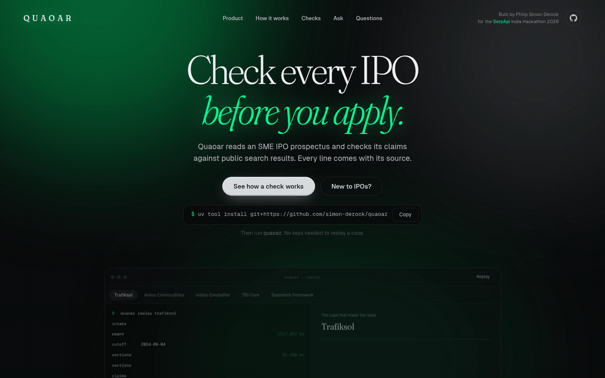
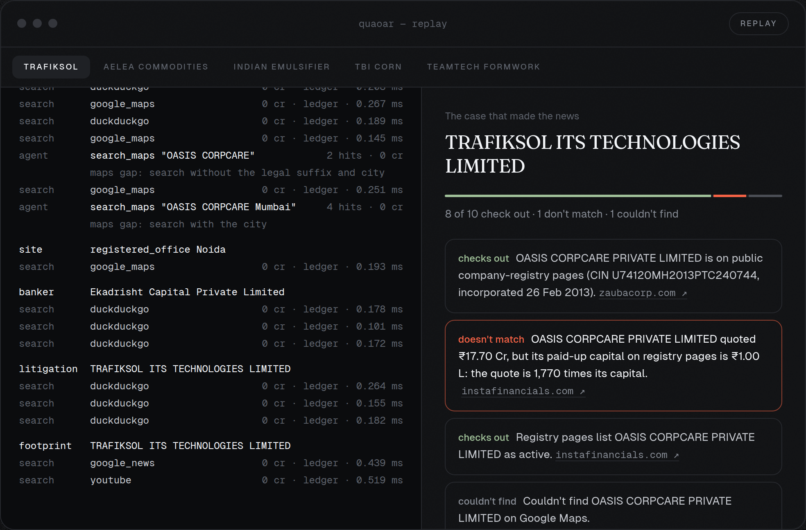
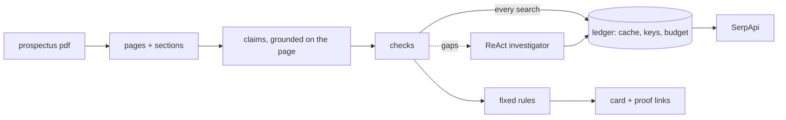

<h1 align="center">Quaoar</h1>

<p align="center"><b>Check every IPO before you apply.</b></p>

<p align="center">
  
</p>

<p align="center">
  <a href="https://github.com/simon-derock/quaoar/actions/workflows/ci.yml"></a>
  
  
  
  
</p>

<p align="center">
  <b>Quaoar reads an SME IPO prospectus and checks what it claims against the outside world.</b><br>
  Every line of its card says <b>checks out</b>, <b>doesn't match</b> or <b>couldn't find</b>, with a source link.<br>
  No verdicts. No advice. <i>Facts with sources.</i>
</p>

<p align="center">
  <a href="https://quaoar.philipsimonderock.com">Website</a> ·
  <a href="https://quaoar.philipsimonderock.com/docs.html">Docs</a> ·
  <a href="#try-it-in-60-seconds">Try it</a> ·
  <a href="#what-it-checks">What it checks</a> ·
  <a href="#proof-that-it-works">Results</a> ·
  <a href="#use-it-from-your-own-agent">MCP</a> ·
  <a href="#honest-limits">Limits</a>
</p>

```bash
curl -fsSL quaoar.philipsimonderock.com/install | sh      # then: quaoar
```

**In your own agent.** An **MCP server** with 7 tools (`replay_card`, `ask_card`, `scan_prospectus`, …) and an **[agent skill](skills/quaoar/SKILL.md)** with playbooks and language rules:
```bash
claude mcp add quaoar -- uvx --from git+https://github.com/simon-derock/quaoar quaoar mcp
```

> Built for the SerpApi India Hackathon 2026, track Commerce & Market Intelligence.

## Why it exists

In 2024 an investors' group noticed that the software vendor named in Trafiksol's IPO prospectus had not filed accounts. SEBI then found the vendor's office locked, and the IPO money was refunded. The prospectus is *required* to name that vendor (ICDR Schedule VI clause 7(b)), so the check can be automated. Quaoar does that check, plus several more, in a few minutes.

## Four ways in

| | | |
|---|---|---|
| **Terminal** | `uv run quaoar` | A chat-style console. Plain language works, even if you know nothing about IPOs. |
| **CLI** | `quaoar scan rhp.pdf` | Scripted scans, `diff` between prospectus versions, ledger and key tools. |
| **Web console** | `quaoar serve` + `web/` | A product page that replays recorded scans. No keys, no uploads. |
| **Your agent** | `quaoar mcp` | Six MCP tools and a skill, so Claude Code can run the check for you. |

<p align="center">
  
</p>

## What it checks

| Check | What it looks at | SerpApi engines |
|---|---|---|
| **Vendor** | The company quoting for the IPO money: on the company registry, active, paid-up capital in proportion to the quote, any court or SEBI page naming it, on Maps | DuckDuckGo (site-restricted), Google Maps |
| **Premises** | The issuer's own registered office, factory or warehouse: is there a Maps listing, is it closed, is a "factory" listed as an apartment | Google Maps |
| **Merchant banker** | SEBI orders naming the banker or the issuers in its past-issues table | DuckDuckGo (site:sebi.gov.in) |
| **Litigation** | Court or SEBI matters naming the issuer that the prospectus does not list | DuckDuckGo (SEBI, Indian Kanoon, IBBI) |
| **News and hype** | Dated adverse coverage; promotion volume shown as context only, never as a verdict | Google News, YouTube |

Statuses come only from fixed rules. The language model reads the prospectus into claims, and every claim must be found on the page it cites or it is dropped.

### Evidence as of the prospectus date
By default Quaoar reads evidence **as of the date printed on the prospectus**, so later news cannot change the card. A Trafiksol scan dated before the SEBI action shows the vendor mismatch and nothing else; `--now` reads everything up to today. For the version an investor sees while the issue is open, scan the red herring prospectus (RHP), not the final prospectus filed after bidding closes.

## Two AI agents, on a short leash
Quaoar uses two PydanticAI agents on Cohere. Both can only **gather and explain evidence**: fixed rules set every status, and code checks everything an agent says before anyone sees it.

| | The Investigator | The Analyst |
|---|---|---|
| **When** | during a scan, when a fixed search comes back empty | after a scan, when someone asks a question |
| **Plans** | which evidence gap to close next, and how to reword the search (registry city, CIN, legal suffix) | which card lines answer the question (a retrieval step marks the related ones), and whether a search is needed at all |
| **Tools** | registry, legal, Maps, news and web searches | `read_line` (free), plus registry, Maps, legal and news follow-ups |
| **Budget** | 8 searches, 6 credits, 10 model requests | 3 searches, 3 credits, 10 model requests |
| **Output** | a handoff: gaps closed and still open | an answer of at most 120 words, citing card lines (L2) and search results (S1) |
| **Checked by code** | the rules read only the evidence; the model can't set a status | every citation must exist; every number must appear in a cited source; wording and advice guards must pass; otherwise the card-only answer is shown |
| **Measured** | 5 gaps closed, 17 left open across five scans | 23/24 expected lines cited, 24/24 passed the wording guard, 6 credits for the first live run ([audit](docs/benchmark-audits/analyst-2026-10-09.md)) |

Shared design, in both:
- **Code builds the queries.** The model chooses search *terms* and writes a one-sentence `why`. Code adds the site allowlist and sends each search through the same cache, key pool and credit budget as every other search. Repeated searches are refused.
- **Web text is data.** Search results are marked as untrusted data in the prompt, and injection-shaped text is flagged.
- **Fixed replies need no model.** Advice questions and instruction-shaped questions get fixed replies.
- **Traces are replayable.** Every tool-call trace is stored, so a scan or a question asked again replays with no model call.
- **Works without a model.** With no keys or no model, the Analyst still answers from the card alone, deterministically.

```bash
quaoar ask trafiksol "why was this flagged?"
```
```
Line 2 doesn't match: the vendor named for the IPO money quoted ₹17.70 crore, while registry pages show its paid-up capital as ₹1 lakh, 1,770 times smaller. That is a reason to look closer, not a conclusion.
  line 2 · https://www.instafinancials.com/company/oasis-corpcare-private-limited-… (search 6ac7fe400e285d07c1e956d5)
answered by the analyst agent
```
In the terminal, any question asked with a card on screen goes to the Analyst (or `/ask …`). From your own agent, it is the MCP tool `ask_card`. Prompt design and measured behaviour: [ADR-0002](docs/decisions/ADR-0002-investigator-prompt.md), [analyst audit](docs/benchmark-audits/analyst-2026-10-09.md).

## Proof that it works

The first test is Trafiksol, the case that made the news. Quaoar flags the vendor with no human help: Oasis Corpcare quoted ₹17.70 Cr against ₹1 lakh of paid-up capital (1,770 times), on the red herring prospectus and on the final one.

Then the question that matters: does it cry wolf? Three prospectuses with no known problem were scanned on the same rules, fixed in advance ([audit](docs/benchmark-audits/controls-2026-10-09.md)).

| Case | Flagged | Checks out / doesn't match / couldn't find |
|---|---|---|
| Trafiksol (red herring) | yes: vendor capital 1,770x | 8 / 1 / 1 |
| Aelea Commodities (control) | no | 4 / 0 / 9 |
| Indian Emulsifier (control) | no | 3 / 0 / 2 |
| TBI Corn (control) | yes: a 2021 SEBI order naming its lead manager | 3 / 1 / 7 |

**Controls flagged: 1 of 3.** The first run flagged 2 of 3, mostly from Quaoar's own bugs (matching a vendor to a same-named company, reading the lead manager as the issuer). Those were fixed as identity and parsing bugs, with the threshold untouched, and the audit shows both runs. The TBI flag is a true record about the banker, not the company, and the card says so.

**The Investigator**, over the five scans: 15 investigations, 29 searches, 5 evidence gaps closed (1 registry, 4 Maps) and 17 left open. It helps at the margin and never changes a verdict.

**A second, pre-registered survey** of six 2026 SME prospectuses ([audit](docs/benchmark-audits/survey-2026-10-09.md)): 4 completed cards with 1 flag (two Delhi court records, with the prospectus's disclosure thresholds likely the explanation), and 2 stopped at their credit cap. It also exposed three parsing gaps, now fixed.

**A scan costs** about 12 to 37 SerpApi searches on a fresh prospectus, 0 on a replay. Seven ordinary companies is not an accuracy claim.

`quaoar diff earlier.pdf later.pdf` compares two versions of a prospectus (draft, red herring, final) and lists vendors, matters and lead managers that were added, removed or changed. It reads claims only, no searches. The promoter list is noisy when a draft lists promoter-group members.


## Try it in 60 seconds
No API keys needed. One line on macOS or Linux (it installs [uv](https://docs.astral.sh/uv/) first if you don't have it):

```bash
curl -fsSL quaoar.philipsimonderock.com/install | sh   # then run: quaoar
```
The same script straight from GitHub: `curl -fsSL https://raw.githubusercontent.com/simon-derock/quaoar/main/install.sh | sh`.
Already have uv: `uv tool install git+https://github.com/simon-derock/quaoar`. Run it once without installing: `uvx --from git+https://github.com/simon-derock/quaoar quaoar replay trafiksol`. Full guide: [docs](https://quaoar.philipsimonderock.com/docs.html).

From a clone:
```bash
git clone https://github.com/simon-derock/quaoar && cd quaoar
uv sync
uv run quaoar replay trafiksol
```
This replays a recorded scan of the Trafiksol red herring prospectus. Other recorded cases are in `fixtures/replay/` (`uv run quaoar` then `/cases`). `teamtech` is a prospectus never seen before, downloaded from sebi.gov.in and scanned live to test user documents; it has no ground truth and is not part of the evaluation.

## Inside the terminal
```
$ uv run quaoar
QUAOAR · check every IPO before you apply
› /replay trafiksol      watch a recorded case
› /proof 2               the evidence behind line 2: page, date, SerpApi search id
› /comment               a neutral public-comment letter from the lines that didn't match
› /scan path/to/rhp.pdf  a live scan (uses SerpApi credits; /mode, /budget)
› /trace  /credits  /help
```
Plain language works too ("show proof for 2"). A complete beginner can type "hi", "what is an SME IPO" or "where do I get a prospectus" and get a plain answer, in English or basic Hinglish. Advice questions ("should I apply?") get the facts and a plain disclaimer, not a view.

Other commands: `quaoar scan`, `ask`, `card`, `comment`, `diff`, `doctor` (checks keys, model access and the ledger without spending credits), `ledger stats|verify`, `keys status`, `export`, `replay`, `serve`, `mcp`.

## Run a live scan on your own prospectus
```bash
cp .env.example .env     # add SERPAPI_API_KEYS and COHERE_API_KEYS
uv run quaoar doctor
uv run quaoar scan path/to/prospectus.pdf            # --mode fixed|agent, --now, --cutoff YYYY-MM-DD
uv run quaoar ledger stats                           # credits by engine and key, cache hit rate
```
Exchange sites (NSE, BSE) forbid automated downloads, so Quaoar refuses their URLs: download the PDF yourself, or use the lead manager's own website.

## Use it from your own agent
```bash
claude mcp add quaoar -- uvx --from git+https://github.com/simon-derock/quaoar quaoar mcp
```
Tools: `list_replays`, `replay_card`, `ask_card`, `scan_prospectus`, `saved_card`, `draft_comment`, `ledger_stats`. Copy [`skills/quaoar/SKILL.md`](skills/quaoar/SKILL.md) into your agent's skills folder for the playbooks and language rules.

## How it is built

- **One road to SerpApi.** Every search goes through one client: query guard, cache, credit budget, key rotation, response cleaning, provenance (`search_id`, hash, time).
- **Google ignores `site:`.** In a probe, Google returned results from other domains for `site:` queries (1 of 10 on the named site); DuckDuckGo returned 10 of 10. All site-restricted searches therefore use DuckDuckGo.
- **Guardrails.** Text from PDFs and search results is untrusted: control characters and bidi tricks are stripped, personal identifiers are masked before anything reaches the model, injection-shaped text is flagged, and the model can never set a status.
- **Same core everywhere.** The CLI, terminal, MCP server and web console run the same scan. The public site is replay only: no keys, no uploads, no live search.

Full design, specs and diagrams: [`PLAN_SPEC.md`](PLAN_SPEC.md). Decisions: [`docs/decisions`](docs/decisions). Audits with their raw method: [`docs/benchmark-audits`](docs/benchmark-audits).

## Honest limits
- **Absence is not a finding.** Small private companies often barely appear online, so "couldn't find" is common and is never counted against a company.
- **Identity is the hard part.** Early runs matched people and firms to unrelated namesakes. Fixes: a person's name alone is never enough; a vendor whose name carries no company form is never matched to a same-named registered company; cards never name individuals.
- **The 100x vendor-capital rule is a screen, not a verdict.** It was fixed before any control was scanned. A tiny vendor quoting a large amount is worth a look, but real small suppliers do this too.
- **Registry snippets are not live filings** and can lag the official records.
- **Point-in-time is partial.** Registry and Maps pages show today's state; strict "before listing" evidence relies on dated news, orders and court records.
- **Small evaluation.** One positive (two versions) and seven ordinary companies: three controls from one banker's website, and four completed cards from a second, pre-registered survey of 2026 prospectuses. No accuracy claim is made.

## Development
```bash
uv sync --locked && ./scripts/gate.sh   # format, lint, strict types, tests, coverage, dead code, security
cd web && npm ci && npm test            # the console
```
Tests are written first and cite the spec they cover (`# spec: SPEC-...`). Timing budgets (parse a rupee amount, hash a request, hit the cache, locate sections in 300 pages) run in CI and print their medians in the job summary.

## Credits
Search data by [SerpApi](https://serpapi.com). Language model: Cohere. Agent framework: PydanticAI. MIT licence.

Built by Philip Simon Derock ([philipsimonderock.com](https://philipsimonderock.com)) for the SerpApi India Hackathon 2026. Favicon dove: [Font Awesome Free](https://fontawesome.com/license/free) (CC BY 4.0). Fonts: Fraunces and Geist (SIL Open Font License 1.1; licence texts ship with the site's fonts). Demo-video music: Beethoven, Symphony No. 1, I, by the Chamber Orchestra of the United States Marine Band, public domain ([source](https://commons.wikimedia.org/wiki/File:Symphony_No._1_in_C_-_I._Adagio_molto,_Allegro_con_brio_-_Chamber_Orchestra_-_United_States_Marine_Band.opus)).
