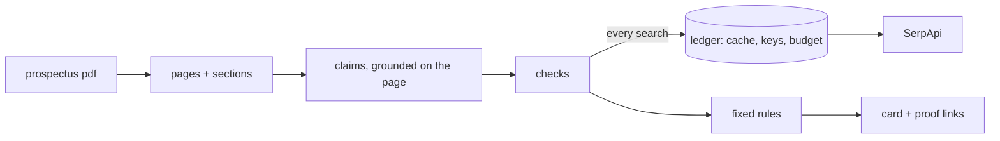

# Quaoar

**Check every IPO before you apply.** *Pehle jaanch, phir apply.*

Quaoar reads an SME IPO prospectus, pulls out the claims that can be checked against the outside world, and checks them through [SerpApi](https://serpapi.com) before anyone applies. Every line of its card says one of three things, with a source link:

- **checks out**
- **doesn't match**
- **couldn't find**

It never says fraud, and it never says buy or sell. *Facts with sources. Not investment advice.*

> Built for the SerpApi India Hackathon 2026, track Commerce & Market Intelligence.

## Why

In 2024 an investors' group noticed that the software vendor named in Trafiksol's IPO prospectus had not filed accounts. SEBI then found the vendor's office locked, and the IPO money was refunded. The prospectus is *required* to name that vendor (ICDR Schedule VI clause 7(b)), so the check can be automated. Quaoar does that check, plus two more, in about two minutes.

## What it checks today

| Check | What it looks at | SerpApi engine |
|---|---|---|
| **Vendor x-ray** | Is the company quoting for the IPO money on the registry, active, and sized for the quote? Is it on Maps? | DuckDuckGo (site search on registry pages), Google Maps |
| **Merchant banker** | Do SEBI orders name the banker, or the issuers in its past-issues table? | DuckDuckGo (site search on sebi.gov.in) |
| **Litigation** | Do court or SEBI matters naming the issuer exist that the prospectus doesn't list? | DuckDuckGo (site search on SEBI, Indian Kanoon, IBBI) |

Statuses come only from fixed rules, never from the language model. The model's only job is to read the prospectus into claims, and every claim must be found on the page it cites or it is dropped.

## Try it with no keys
```bash
git clone https://github.com/simon-derock/quaoar && cd quaoar
uv sync
uv run quaoar replay fixtures/replay/trafiksol
```
This replays a real recorded scan of the Trafiksol prospectus. On it, Quaoar reports:

> OASIS CORPCARE PRIVATE LIMITED quoted ₹17.70 Cr, but its paid-up capital on registry pages is ₹1.00 L: the quote is 1,770 times its capital.

The whole scan uses **8 SerpApi searches** (2 for the vendor, 2 for the banker, 4 for litigation), and re-running it costs 0 because everything is cached in a local, hash-checked ledger.

## Run a live scan
```bash
cp .env.example .env     # add SERPAPI_API_KEYS and COHERE_API_KEYS
uv run quaoar scan path/to/prospectus.pdf --cutoff 2024-09-03
uv run quaoar ledger stats      # credits by engine and key, cache hit rate
```
Exchange sites (NSE, BSE) forbid automated downloads, so Quaoar refuses their URLs: download the PDF yourself, or use the lead manager's own website.

## Use it from your own agent (MCP + skill)
```bash
claude mcp add quaoar -- uvx --from git+https://github.com/simon-derock/quaoar quaoar mcp
```
Tools: `list_replays`, `replay_card`, `scan_prospectus`, `saved_card`, `ledger_stats`. Copy [`skills/quaoar/SKILL.md`](skills/quaoar/SKILL.md) into your agent's skills folder for the playbooks and language rules.

## How it is built

- **One road to SerpApi.** Every search goes through one client: query guard, cache, credit budget, key rotation, response cleaning, provenance (`search_id`, hash, time).
- **Guardrails.** Text from PDFs and search results is untrusted: control characters and bidi tricks are stripped, personal identifiers are masked before anything reaches the model, injection-shaped text is flagged, and the model can never set a status.
- **Same core everywhere.** The CLI, the MCP server and the web console all run the same scan.
- **Public site is replay only.** The API and web page hold no keys and run no live search.

Full design, with specs and diagrams: [`PLAN_SPEC.md`](PLAN_SPEC.md). Decisions: [`docs/decisions`](docs/decisions).

## Honest limits
- **Absence is not a finding.** Small private companies often barely appear online, so "couldn't find" is common and is never counted against a company.
- **Name matching is hard.** An early run matched promoters to unrelated court cases with the same name. It is fixed (a person's name alone is never enough) and recorded in [`docs/benchmark-audits`](docs/benchmark-audits/probe-2026-10-09.md).
- **Registry snippets are not live filings.** They can lag the official records.
- **Point-in-time is partial.** Registry and Maps pages show today's state, so strict "before listing" evidence relies on dated news, orders and court records.
- Tested on one real prospectus so far; no accuracy claim is made.

## Development
```bash
uv sync --locked && ./scripts/gate.sh   # format, lint, strict types, tests, coverage, dead code, security
cd web && npm ci && npm test            # the console
```
Tests are written first and cite the spec they cover (`# spec: SPEC-...`). Timing budgets (parse a rupee amount, hash a request, hit the cache, locate sections in 300 pages) run in CI and print their medians in the job summary.

## Credits
Search data by [SerpApi](https://serpapi.com), including its [`serpapi-search-tools`](https://github.com/serpapi/serpapi-search-tools-python). Language model: Cohere. Agent framework: PydanticAI. MIT licence.
